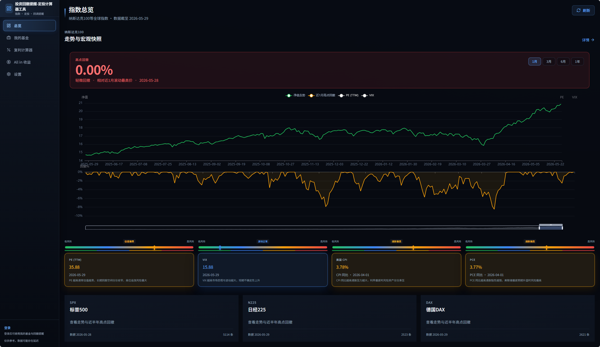
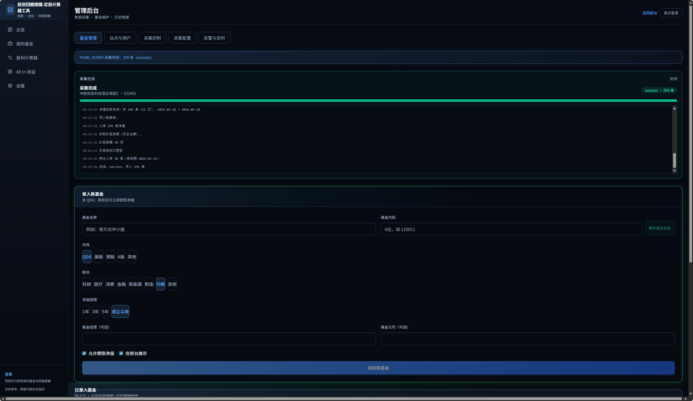
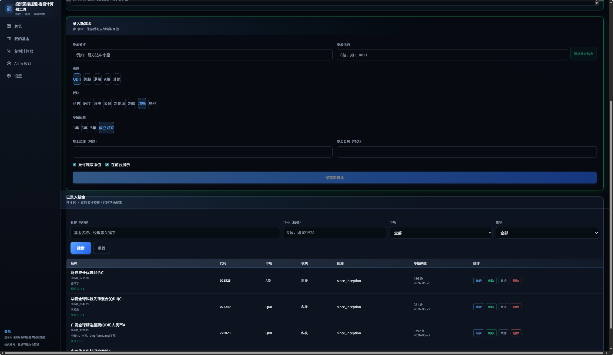
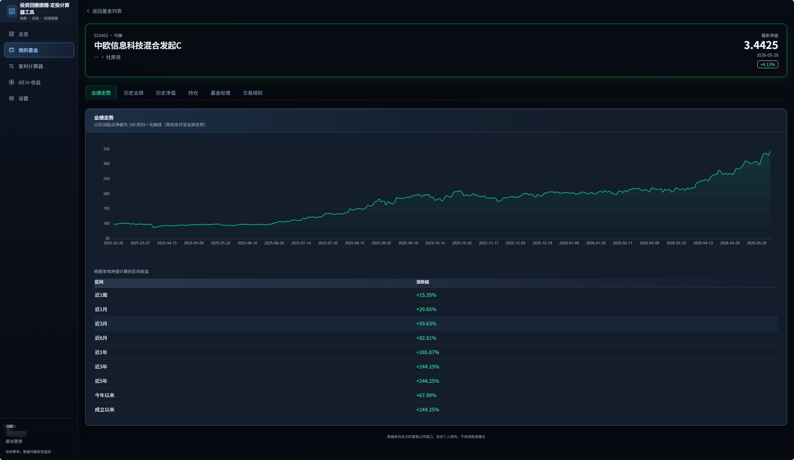
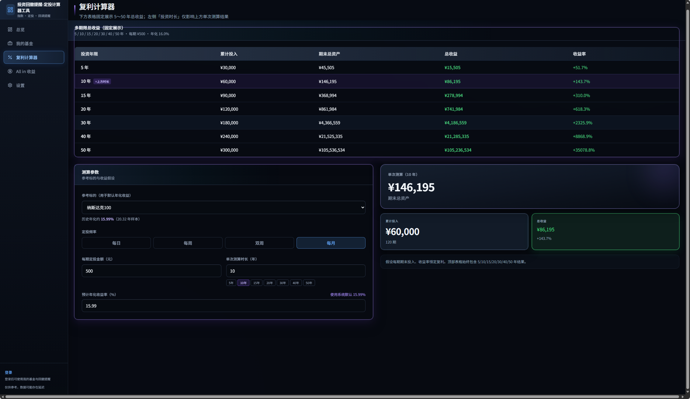
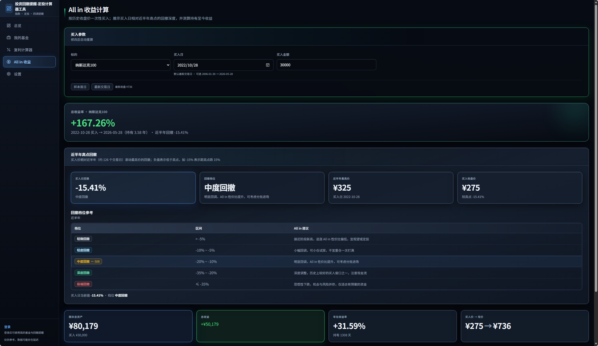
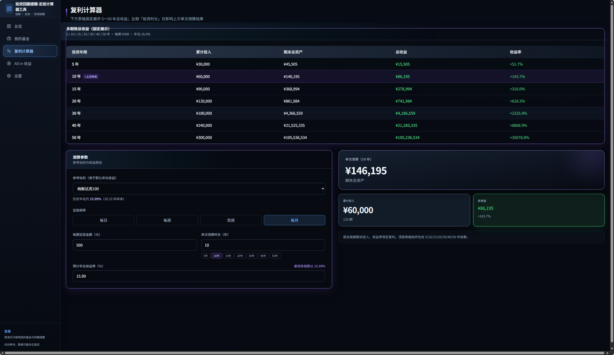
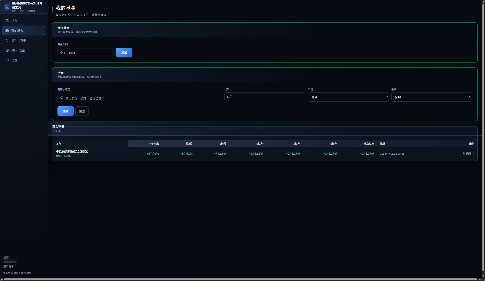
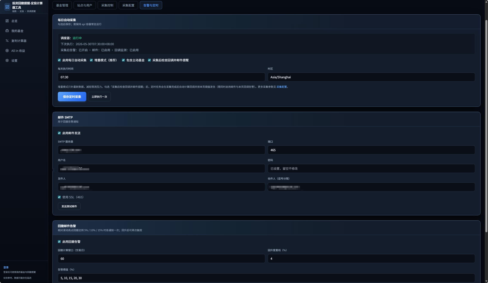
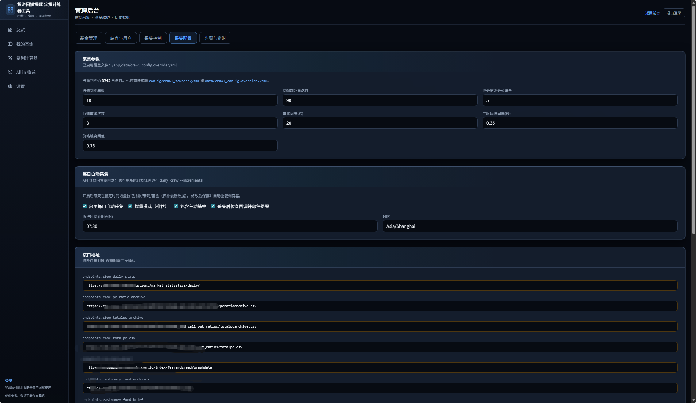

# 智能投资评分与定投系统 / Smart Investment Scoring & DCA System

[](webimage/dashboard.png)

---

[**中文**](#中文版) | [**English**](#english)

---

# 中文版

基于量化指标的综合评分（S）、智能定投建议与 DeepSeek 中文解读的投资分析平台。支持 **中国国内市场**，可 **自由添加自定义基金**，自动获取数据并触发提醒。

## 核心亮点

> **🎯 可灵活配置多档回撤阈值邮件提醒** — 支持同时设置多个 X% 回撤警戒点（如 5%、10%、15%、20%...），当指数或基金净值回撤触及阈值时自动发送邮件告警，助您及时把握买卖时机。

> **🇨🇳 中国国内市场深度支持** — 支持 A 股指数、国内主动基金。可自由添加自定义基金，系统自动爬取净值、持仓、经理档案等数据，并支持回撤提醒。

| 核心能力 | 说明 |
|---|---|
| 🎯 多档回撤告警 | 自由设定 N 个 X% 阈值，触发即邮件通知 |
| 🇨🇳 国内市场 | 支持 A 股指数、国内主动基金，自定义基金录入 |
| 📝 自定义基金 | 手动录入基金代码，自动解析并爬取数据 |
| 📊 综合评分 S-Score | 趋势、动量、波动、估值、宏观五维加权评分 |
| 🤖 DeepSeek 中文解读 | 每日评分 + AI 解读投资信号 |
| 💰 智能定投 DCA | 基于评分系统的定投倍率建议 |
| 📈 数据自动采集 | 定时爬取行情、宏观指标、基金净值 |
| 🔔 多场景告警 | 回撤、异常波动等可扩展告警体系 |

## 功能预览

| 截图 | 说明 |
|---|---|
|  | **首页仪表盘** — 指数评分总览与市场健康度 |
|  | **数据抓取** — 一键拉取行情、宏观指标 |
|  | **自定义录入与管理** — 手动录入基金信息 |
|  | **基金详情** — 业绩、净值、持仓、经理档案 |
|  | **计算器** — 一次投入与复利计算 |
|  | **一次投入产出计算** — 按日/周/月测算收益 |
|  | **复利计算** — 定投复利增长模拟 |
|  | **多用户** — 多账户支持与权限管理 |
|  | **回撤提醒配置** — 自定义回撤阈值告警 |
|  | **自动采集配置** — 定时任务与采集参数 |

## 文档索引

| 文档 | 说明 |
|---|---|
| [docs/PROJECT_PLAN.md](docs/PROJECT_PLAN.md) | 总计划：需求摘要、分期、里程碑 |
| [docs/ARCHITECTURE.md](docs/ARCHITECTURE.md) | 技术架构、模块、数据流 |
| [docs/DATA_SOURCES.md](docs/DATA_SOURCES.md) | 免费稳定数据源与采集策略 |
| [docs/UI_DESIGN.md](docs/UI_DESIGN.md) | 界面与交互规范 |
| [config/instruments.yaml](config/instruments.yaml) | 标的 InstrumentProfile 草案 |
| [config/metric_catalog.yaml](config/metric_catalog.yaml) | 指标目录（爬取 vs 计算） |
| [config/scoring_weights.yaml](config/scoring_weights.yaml) | 各市场维度权重 |
| [config/dca_defaults.yaml](config/dca_defaults.yaml) | 定投与倍数默认配置 |

## 当前阶段

**M6 前端 MVP** — 专业深色仪表盘（纳指 / 标普）。推荐 **Docker** 启动 API + Web。

### Docker 一键启动（推荐）

在项目根目录执行（PowerShell）：

```powershell
cd "d:\桌面\投资分析"

# 1. 环境配置（首次使用）
copy .env.docker.example .env
# 编辑 .env：ADMIN_USERNAME / ADMIN_PASSWORD、FRED_API_KEY、代理等

# 2. 构建镜像（首次或依赖变更后）
.\scripts\docker-build.ps1

# 3. 写入行情与评分（首次或需重拉数据时，约数分钟）
.\scripts\bootstrap-data.ps1

# 4. 后台启动 API + 前端
docker compose -p invest-analyzer up -d api web
```

| 地址 | 说明 |
|---|---|
| http://localhost:3009 | 前端仪表盘 |
| http://localhost:3009/admin/login | 管理后台（`.env` 中 `ADMIN_USERNAME` / `ADMIN_PASSWORD`） |
| http://localhost:18001/docs | API 文档（Swagger） |

**日常一键启动**（已构建过、只需开服务）：

```powershell
cd "d:\桌面\投资分析"
docker compose -p invest-analyzer up -d api web
```

若浏览器出现 **Application error**，多半是 Web 镜像过旧或未重建，见 [docs/TROUBLESHOOTING.md](docs/TROUBLESHOOTING.md)。

**停止服务**：

```powershell
docker compose -p invest-analyzer down
```

### 重启前端 / 后端

| 场景 | 命令 |
|---|---|
| 只重启后端 API | `docker compose -p invest-analyzer restart api` |
| 只重启前端 Web | `docker compose -p invest-analyzer restart web` |
| 同时重启前后端 | `docker compose -p invest-analyzer restart api web` |
| 改了 `.env` 或环境变量 | 先 `restart api` |
| 改了 `invest/` Python 代码 | API 已挂载卷带 `--reload`，一般自动生效；不生效则 `restart api` |
| 改了 `web/` 前端代码 | **必须** `build web` 后再 `up -d web`（仅 `restart` 不会更新镜像内代码） |
| 页面 Application error | 同上重建 `web`；并确认已跑 `bootstrap-data.ps1` |
| 改了 `requirements.txt` 或 Dockerfile | `.\scripts\docker-build.ps1` 或 `build api web`，再 `up -d api web` |

查看运行日志：

```powershell
docker compose -p invest-analyzer logs -f api web
```

镜像加速、Web 构建慢等问题见 [docs/DOCKER.md](docs/DOCKER.md)。

### 管理后台（M5）


**中国国内市场** 功能一览：

- **指数分键拉取**：纳斯达克100、标普500、日经、DAX
- **国内主动基金**：
  - 录入前点击 **「解析基金信息」**，自动识别基金详情
  - 自动爬取：单位净值、持仓信息、交易规则、经理档案
  - 支持自定义添加任意基金代码
- **历史数据管理**：查看、按日期去重、删除、重新爬取
- **首页总览**：展示已启用的指数与国内基金

 | 
---|---

本地仅跑前端：

```powershell
cd web && npm install && npm run dev
```

（Web 默认 3009，需 API 在 18001）

- 前端：[docs/FRONTEND.md](docs/FRONTEND.md)
- 评分：[docs/M2_SCORING.md](docs/M2_SCORING.md)
- 采集配置：[docs/CRAWL_CONFIG.md](docs/CRAWL_CONFIG.md)
- 数据隔离：[docs/DATA_ISOLATION.md](docs/DATA_ISOLATION.md)
- NDX 评分：[docs/NDX_SCORING.md](docs/NDX_SCORING.md)
- SPX 评分：[docs/SPX_SCORING.md](docs/SPX_SCORING.md)
- 定投：[docs/M3_DCA.md](docs/M3_DCA.md)

### 本地 Python（3.8 兼容）

若 pip 报 `ProxyError`（系统代理 127.0.0.1:10808 未启动）：先关系统代理，或启动 Clash/V2Ray；也可用项目内 `pip.conf`：

```powershell
cd 投资分析
$env:PIP_CONFIG_FILE = "$PWD\pip.conf"
.\scripts\install.ps1
```

手动安装：

```powershell
cd 投资分析
$env:PIP_CONFIG_FILE = "$PWD\pip.conf"
python -m venv .venv
.\.venv\Scripts\pip install -r requirements.txt pytest

# 初始化数据库
.\.venv\Scripts\python -m invest.jobs.daily_crawl --init-db

# 采集美股任务
python -m invest.jobs.daily_crawl --job crawl_ndx
python -m invest.jobs.daily_crawl --job crawl_spx

# 日经 + DAX + 汇率
python -m invest.jobs.daily_crawl --job crawl_jp_de

# 全部 + 数据新鲜度
python -m invest.jobs.daily_crawl --job all

# M2：重算评分（需先有 OHLCV 数据）
python -m invest.jobs.recompute_scores --all

# 仅查看库内最新日期
python -m invest.jobs.daily_crawl --health
```

可选 `.env` 配置：

- `FRED_API_KEY` — [免费申请](https://fred.stlouisfed.org/docs/api/api_key.html)，采集美债10Y、美元指数
- `HTTP_PROXY=http://127.0.0.1:10808` — 开启 Clash 等代理后，用于 Yahoo/Stooq 行情（国内通常需要）

故障排查见 [docs/TROUBLESHOOTING.md](docs/TROUBLESHOOTING.md)

---

[**↑ 返回顶部**](#智能投资评分与定投系统--smart-investment-scoring--dca-system) | [**English ↓**](#english)

---

# English

An investment analysis platform with quantitative scoring (S), smart DCA suggestions, and DeepSeek-powered Chinese analysis. Supports **China domestic market** with **custom fund entries** — auto-fetch data and trigger alerts.

## Key Features

> **🎯 Flexible multi-level drawdown email alerts** — Configure multiple drawdown thresholds (e.g., 5%, 10%, 15%, 20%...) simultaneously. Get automated email notifications when index or fund NAV drawdown hits any threshold.

> **🇨🇳 China domestic market support** — A-share indices, China active funds. Add custom funds — the system auto-crawls NAV, holdings, manager profiles, and supports drawdown alerts.

| Capability | Description |
|---|---|
| 🎯 Multi-level drawdown alerts | Set N thresholds; email notification on trigger |
| 🇨🇳 China domestic market | A-share indices, China active funds, custom fund entry |
| 📝 Custom fund addition | Enter fund code, auto-parse and crawl data |
| 📊 S-Score (composite scoring) | 5-dimension weighted scoring: trend, momentum, volatility, valuation, macro |
| 🤖 DeepSeek AI analysis | Daily scores with AI-powered investment insights in Chinese |
| 💰 Smart DCA | Score-based DCA multiplier suggestions |
| 📈 Automated data crawl | Scheduled crawl for prices, macro indicators, fund NAV |
| 🔔 Multi-scenario alerts | Extendable alert system for drawdown, volatility, and more |

## Feature Overview

| Screenshot | Description |
|---|---|
|  | **Dashboard** — Index score overview & market health |
|  | **Data Crawl** — One-click fetch for prices & macro indicators |
|  | **Custom Fund Entry** — Add and manage fund information |
|  | **Fund Detail** — Performance, NAV, holdings, manager profile |
|  | **Calculator** — Lump-sum & compound interest calculator |
|  | **Lump Sum Projection** — Returns by day/week/month |
|  | **Compound Growth** — DCA compound growth simulation |
|  | **Multi-User** — Account support & access control |
|  | **Drawdown Alert Config** — Custom threshold alerts |
|  | **Auto Crawl Config** — Scheduled tasks & crawl settings |

## Document Index

| Document | Description |
|---|---|
| [docs/PROJECT_PLAN.md](docs/PROJECT_PLAN.md) | Roadmap: requirements, phases, milestones |
| [docs/ARCHITECTURE.md](docs/ARCHITECTURE.md) | Tech architecture, modules, data flow |
| [docs/DATA_SOURCES.md](docs/DATA_SOURCES.md) | Free data sources & crawl strategy |
| [docs/UI_DESIGN.md](docs/UI_DESIGN.md) | UI & interaction specifications |
| [config/instruments.yaml](config/instruments.yaml) | InstrumentProfile definitions |
| [config/metric_catalog.yaml](config/metric_catalog.yaml) | Metric catalog (crawl vs compute) |
| [config/scoring_weights.yaml](config/scoring_weights.yaml) | Scoring weights by market |
| [config/dca_defaults.yaml](config/dca_defaults.yaml) | DCA defaults & multiplier config |

## Current Phase

**M6 Frontend MVP** — Professional dark dashboard (NDX / SPX). Docker recommended for API + Web.

### One-Click Docker Setup (Recommended)

Run from project root (PowerShell):

```powershell
cd "d:\桌面\投资分析"

# 1. Environment setup (first time)
copy .env.docker.example .env
# Edit .env: ADMIN_USERNAME / ADMIN_PASSWORD, FRED_API_KEY, proxy, etc.

# 2. Build images (first time or after dependency changes)
.\scripts\docker-build.ps1

# 3. Seed market data & scores (first time or refresh, takes a few minutes)
.\scripts\bootstrap-data.ps1

# 4. Start API + frontend in background
docker compose -p invest-analyzer up -d api web
```

| URL | Description |
|---|---|
| http://localhost:3009 | Frontend Dashboard |
| http://localhost:3009/admin/login | Admin Panel (uses `.env` `ADMIN_USERNAME` / `ADMIN_PASSWORD`) |
| http://localhost:18001/docs | API Docs (Swagger) |

**Daily quick start** (already built, just start services):

```powershell
cd "d:\桌面\投资分析"
docker compose -p invest-analyzer up -d api web
```

If you see **Application error**, the web image is likely stale — see [docs/TROUBLESHOOTING.md](docs/TROUBLESHOOTING.md).

**Stop services**:

```powershell
docker compose -p invest-analyzer down
```

### Restart Frontend / Backend

| Scenario | Command |
|---|---|
| Restart API only | `docker compose -p invest-analyzer restart api` |
| Restart Web only | `docker compose -p invest-analyzer restart web` |
| Restart both | `docker compose -p invest-analyzer restart api web` |
| Changed `.env` or env vars | Run `restart api` first |
| Changed `invest/` Python code | API is volume-mounted with `--reload`, auto-reloads; if not, `restart api` |
| Changed `web/` frontend code | **Must** `build web` then `up -d web` (restart alone won't update image) |
| Page Application error | Rebuild `web` as above; ensure `bootstrap-data.ps1` has been run |
| Changed `requirements.txt` or Dockerfile | `.\scripts\docker-build.ps1` or `build api web`, then `up -d api web` |

View logs:

```powershell
docker compose -p invest-analyzer logs -f api web
```

For image mirror speed, slow web builds, etc. see [docs/DOCKER.md](docs/DOCKER.md).

### Admin Panel (M5)


**China domestic market** features:

- **Index crawl**: NDX / SPX / N225 / DAX
- **China active funds**:
  - Click **"Parse Fund Info"** before entry — auto-identifies fund details
  - Auto-crawls: NAV, holdings, trading rules, manager profiles
  - Supports custom fund code addition
- **History management**: view, deduplicate by date, delete, re-crawl
- **Dashboard overview**: shows enabled indices & domestic funds

 | 
---|---

Run frontend locally:

```powershell
cd web && npm install && npm run dev
```

(Web defaults to port 3009, requires API on 18001)

- Frontend: [docs/FRONTEND.md](docs/FRONTEND.md)
- Scoring: [docs/M2_SCORING.md](docs/M2_SCORING.md)
- Crawl config: [docs/CRAWL_CONFIG.md](docs/CRAWL_CONFIG.md)
- Data isolation: [docs/DATA_ISOLATION.md](docs/DATA_ISOLATION.md)
- NDX scoring: [docs/NDX_SCORING.md](docs/NDX_SCORING.md)
- SPX scoring: [docs/SPX_SCORING.md](docs/SPX_SCORING.md)
- DCA: [docs/M3_DCA.md](docs/M3_DCA.md)

### Local Python (Python 3.8+)

If pip shows `ProxyError`: disable system proxy or start Clash/V2Ray; alternatively use the bundled `pip.conf`:

```powershell
cd 投资分析
$env:PIP_CONFIG_FILE = "$PWD\pip.conf"
.\scripts\install.ps1
```

Manual install:

```powershell
cd 投资分析
$env:PIP_CONFIG_FILE = "$PWD\pip.conf"
python -m venv .venv
.\.venv\Scripts\pip install -r requirements.txt pytest

# Initialize database
.\.venv\Scripts\python -m invest.jobs.daily_crawl --init-db

# Crawl US market data
python -m invest.jobs.daily_crawl --job crawl_ndx
python -m invest.jobs.daily_crawl --job crawl_spx

# Nikkei + DAX + FX
python -m invest.jobs.daily_crawl --job crawl_jp_de

# All + data health check
python -m invest.jobs.daily_crawl --job all

# Recompute scores (requires OHLCV data first)
python -m invest.jobs.recompute_scores --all

# Check latest data dates
python -m invest.jobs.daily_crawl --health
```

Optional `.env` config:

- `FRED_API_KEY` — [Free sign-up](https://fred.stlouisfed.org/docs/api/api_key.html), for US 10Y yield & DXY
- `HTTP_PROXY=http://127.0.0.1:10808` — Proxy for Yahoo/Stooq (typically needed in China)

Troubleshooting: [docs/TROUBLESHOOTING.md](docs/TROUBLESHOOTING.md)

---

## Disclaimer

This system is for research and personal reference only. It does not constitute investment advice. Past performance does not guarantee future results.

## Copyright & License

**Copyright © 2026 多点互动 (MoreTouch). All rights reserved.**

**Website:** [www.moretouch.com.cn](https://www.moretouch.com.cn)

This project is open-sourced under the **MIT License** — you are free to use, modify, and distribute, provided that the above copyright notice is retained.

```
MIT License

Copyright (c) 2026 多点互动 (MoreTouch) — www.moretouch.com.cn

Permission is hereby granted, free of charge, to any person obtaining a copy
of this software and associated documentation files (the "Software"), to deal
in the Software without restriction, including without limitation the rights
to use, copy, modify, merge, publish, distribute, sublicense, and/or sell
copies of the Software, and to permit persons to whom the Software is
furnished to do so, subject to the following conditions:

The above copyright notice and this permission notice shall be included in all
copies or substantial portions of the Software.

THE SOFTWARE IS PROVIDED "AS IS", WITHOUT WARRANTY OF ANY KIND, EXPRESS OR
IMPLIED, INCLUDING BUT NOT LIMITED TO THE WARRANTIES OF MERCHANTABILITY,
FITNESS FOR A PARTICULAR PURPOSE AND NONINFRINGEMENT. IN NO EVENT SHALL THE
AUTHORS OR COPYRIGHT HOLDERS BE LIABLE FOR ANY CLAIM, DAMAGES OR OTHER
LIABILITY, WHETHER IN AN ACTION OF CONTRACT, TORT OR OTHERWISE, ARISING FROM,
OUT OF OR IN CONNECTION WITH THE SOFTWARE OR THE USE OR OTHER DEALINGS IN THE
SOFTWARE.
```

---

[**↑ Back to top**](#智能投资评分与定投系统--smart-investment-scoring--dca-system) | [**中文 ↑**](#中文版)
