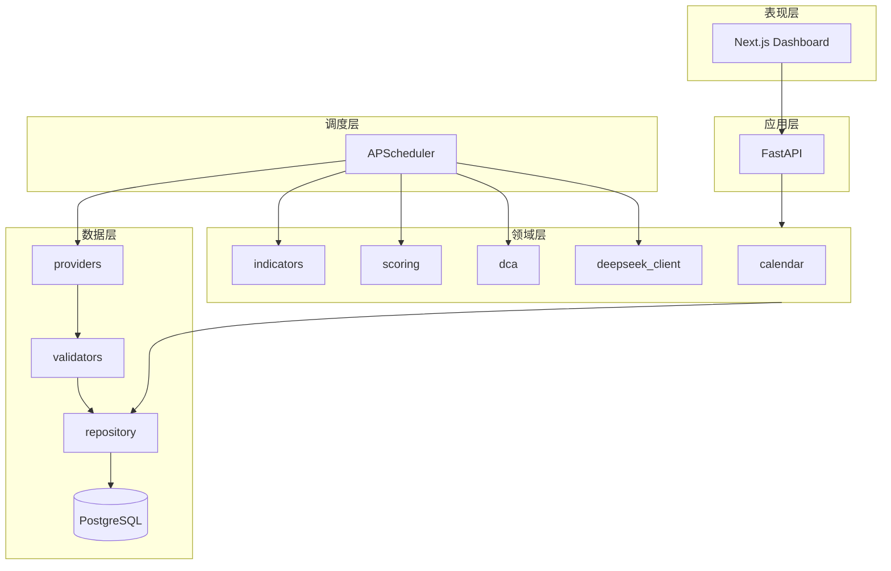

# 技术架构草案

## 1. 逻辑分层



## 2. InstrumentProfile 运行时模型

```python
# 概念模型（实现时可用 Pydantic）
class InstrumentProfile:
    instrument_id: str
    display_name: str
    asset_class: str          # index_us | index_jp | index_de | cn_active_fund
    benchmark_id: str | None  # 基金对比基准
    calendar_id: str          # US_NYSE | JP_TSE | DE_XETRA | CN_SSE_SZSE
    metrics: dict[str, list[str]]   # dimension -> metric_ids
    dimension_weights: dict[str, float]
    data_sources: dict[str, str]    # metric_or_series -> provider_key
    crawl: CrawlConfig
    dca: DcaConfig | None
    enabled: bool
```

引擎流程：

1. 加载 `instruments.yaml` + `metric_catalog.yaml`
2. `calendar.is_trading_day()` / `calendar.is_dca_day()`
3. `providers.fetch()` → `validators.validate()` → `repository.upsert()`
4. `indicators.compute(profile, trade_date)` — 仅依赖 official 数据
5. `scoring.compute_s(profile, trade_date)` → 0..100
6. 若 `is_dca_day`：`dca.suggest_amount(P, M, S)` → 可选 `ai.generate_report()`

## 3. 数据库表（草案）

### 3.1 原始与序列

| 表名 | 主键 | 核心字段 |
|------|------|----------|
| `instruments` | instrument_id | asset_class, config_json |
| `ohlcv` | instrument_id, trade_date | o,h,l,c,v, source, status |
| `fund_nav` | fund_code, nav_date | nav, acc_nav, daily_return, status |
| `macro_series` | series_id, trade_date | value (vix, us10y, usdjpy, vdax…) |
| `valuation_series` | instrument_id, trade_date | pe_ttm, pb, dividend_yield |
| `fund_meta` | fund_code | name, benchmark, fee, updated_at |
| `fund_subscription` | fund_code, checked_at | status, daily_limit |

`status`: `provisional` | `official` | `stale`

### 3.2 衍生与业务

| 表名 | 说明 |
|------|------|
| `indicator_values` | instrument_id, trade_date, metric_id, value |
| `dimension_scores` | instrument_id, trade_date, dimension, score |
| `composite_scores` | instrument_id, trade_date, s, meta_json |
| `dca_suggestions` | user/portfolio, dca_date, planned, suggested, s, m |
| `ai_reports` | instrument_id, report_date, content_json, model |
| `crawl_audit` | job_id, started_at, rows, errors |

### 3.3 用户与组合（M6）

| 表名 | 说明 |
|------|------|
| `users` | 可选，本地 MVP 可单用户配置表 |
| `portfolios` | 多标的、各 P、频率、M |
| `cash_pool_ledger` | 少投累积余额 |

## 4. 评分公式（规则层）

对每个维度 \(d\)，指标 \(i\) 归一化到 \([0,1]\)（常用：滚动 5 年分位数或 sigmoid）：

\[
\text{dim}_d = \sum_i w_{d,i} \cdot \text{norm}(x_i)
\]

综合分（越高越谨慎）：

\[
S = 100 \times \sum_d w_d \cdot \text{dim}_d
\]

权重 \(w_d\) 来自 `scoring_weights.yaml`，按 `asset_class` 继承/覆盖。

## 5. 定投映射 f(S)

参数：\(P\) 计划金额，\(M \in \{1.5, 2.0\}\)，\(S_{mid}=50\)，\(\alpha_{min}=0.4\)

```text
S >= S_mid:
  f = 1 - (1 - alpha_min) * (S - S_mid) / (100 - S_mid)

S < S_mid:
  f = 1 + (M - 1) * (S_mid - S) / S_mid

amount = round(P * f)
amount = clip(amount, P * alpha_min, P * M)
# 再应用 smooth vs 上次建议、现金池逻辑
```

**AI 不参与 f 的计算。**

## 6. API 端点（草案）

| Method | Path | 说明 |
|--------|------|------|
| GET | /api/v1/instruments | 标的列表 |
| GET | /api/v1/scores/{id}/latest | 最新 S + 维度 |
| GET | /api/v1/scores/{id}/history | 历史 S |
| GET | /api/v1/indicators/{id}/latest | 指标快照 |
| POST | /api/v1/dca/preview | body: P, M, frequency → 若今日定投日则建议额 |
| GET | /api/v1/dca/calendar/{id} | 定投日历 |
| GET | /api/v1/reports/{id}/latest | AI 中文报告 |
| GET | /api/v1/backtest | 固定 vs 动态定投 |
| GET | /api/v1/health | 数据新鲜度、最近 crawl 状态 |

## 7. 任务编排（Cron 北京时间）

| Job | Cron | 内容 |
|-----|------|------|
| crawl_us | `0 7 * * 1-5` | QQQ, GSPC, VIX, FRED 10Y, PE 源 |
| crawl_jp_de | `30 7 * * 1-5` | N225, GDAXI, USDJPY, EURUSD, VDAX |
| crawl_cn_nav_pm | `30 22 * * 1-5` | 基金净值 partial |
| crawl_cn_nav_am | `0 2 * * 2-6` | 基金净值 official |
| recompute | `15 7 * * 1-5` | 指标 + S（US/JP/DE） |
| recompute_cn | `30 2 * * 2-6` | 基金指标 + S |
| dca_ai | `0 8 * * *` | 定投日 → 建议 + DeepSeek |

## 8. 配置驱动

所有标的差异通过 YAML 表达，代码零分叉：

- `config/instruments.yaml`
- `config/metric_catalog.yaml`
- `config/scoring_weights.yaml`
- `config/dca_defaults.yaml`

热更新：MVP 重启加载；后期 watch 文件或 DB 配置表。

## 9. 测试策略

| 类型 | 内容 |
|------|------|
| 单元 | 指标公式、f(S)、日历定投日 |
| 集成 | provider mock → validator → repo |
| 回归 | 固定 CSV 快照，S 与金额不变 |
| E2E | API + 前端冒烟（Playwright 可选） |
